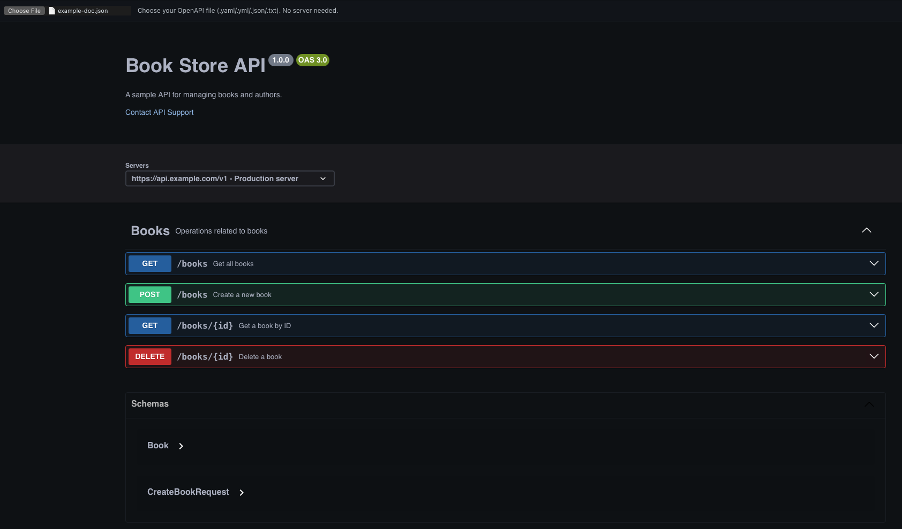

# swagger-api-viewer-darkmode

Simple HTML file that allows you to load swagger doc files `yaml | yml | json | txt` and view them in dark mode.

## Usage

* Git clone it
* Open `viewer.html` in your browser
* In the top left you will see an upload button to load the doc file
* LONG LIVE YOUR EYES!

You can use the example file provided to check it out.
